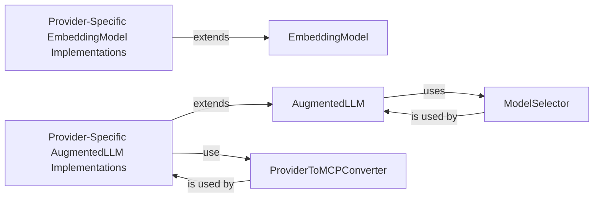

<Info>
This documentation was generated by [CodeBoarding](https://github.com/CodeBoarding/GeneratedOnBoardings) to provide comprehensive architectural insights into the mcp-agent framework.
</Info>

## Details

This component serves as the central hub for all interactions with Large Language Models (LLMs) and text embedding models within the `mcp_agent` framework. Its primary purpose is to abstract away the complexities and provider-specific details of various AI models, offering a unified, extensible, and intelligent interface. This centralization promotes reusability, simplifies the integration of new models, and ensures optimal model selection based on performance and cost criteria.

### AugmentedLLM
This is the foundational abstract class that defines the unified interface for all Large Language Model (LLM) interactions within the framework. It extends the base `Agent` class and provides core capabilities such as prompt conversion, structured output generation, and tool calling, making it a versatile interface for various LLM-powered operations.

**Related Classes/Methods**:

- <a href="https://github.com/CodeBoarding/mcp-agent/blob/main/src/mcp_agent/workflows/llm/augmented_llm.py#L218-L668" target="_blank" rel="noopener noreferrer">`mcp_agent.workflows.llm.augmented_llm.AugmentedLLM` (218:668)</a>

### ModelSelector
This component is responsible for intelligently selecting the most appropriate LLM for a given request. It evaluates various factors such as cost, speed, and intelligence benchmarks of available models, ensuring efficient resource utilization and optimal performance for LLM calls.

**Related Classes/Methods**:

- <a href="https://github.com/CodeBoarding/mcp-agent/blob/main/src/mcp_agent/workflows/llm/llm_selector.py#L96-L413" target="_blank" rel="noopener noreferrer">`mcp_agent.workflows.llm.llm_selector.ModelSelector` (96:413)</a>

### EmbeddingModel
This abstract base class defines the standard interface for generating text embeddings. It allows for seamless integration of different embedding model providers, abstracting away their specific APIs and enabling consistent semantic understanding across the framework.

**Related Classes/Methods**:

- <a href="https://github.com/CodeBoarding/mcp-agent/blob/main/src/mcp_agent/workflows/embedding/embedding_base.py#L13-L31" target="_blank" rel="noopener noreferrer">`mcp_agent.workflows.embedding.embedding_base.EmbeddingModel` (13:31)</a>

### Provider-Specific AugmentedLLM Implementations
These concrete classes extend `AugmentedLLM` and provide the actual implementation details for interacting with specific LLM providers (e.g., Anthropic, OpenAI, Google, Bedrock, Azure, Ollama). They translate the unified `AugmentedLLM` interface calls into provider-specific API requests.

**Related Classes/Methods**:

- <a href="https://github.com/CodeBoarding/mcp-agent/blob/main/src/mcp_agent/workflows/llm/augmented_llm_anthropic.py#L110-L722" target="_blank" rel="noopener noreferrer">`mcp_agent.workflows.llm.augmented_llm_anthropic.AnthropicAugmentedLLM` (110:722)</a>
- <a href="https://github.com/CodeBoarding/mcp-agent/blob/main/src/mcp_agent/workflows/llm/augmented_llm_openai.py#L80-L845" target="_blank" rel="noopener noreferrer">`mcp_agent.workflows.llm.augmented_llm_openai.OpenAIAugmentedLLM` (80:845)</a>
- <a href="https://github.com/CodeBoarding/mcp-agent/blob/main/src/mcp_agent/workflows/llm/augmented_llm_google.py#L34-L319" target="_blank" rel="noopener noreferrer">`mcp_agent.workflows.llm.augmented_llm_google.GoogleAugmentedLLM` (34:319)</a>

### Provider-Specific EmbeddingModel Implementations
These concrete classes extend `EmbeddingModel` and provide the specific logic for generating embeddings using different providers (e.g., Cohere, OpenAI). They ensure that the framework can leverage various embedding services through a consistent interface.

**Related Classes/Methods**:

- <a href="https://github.com/CodeBoarding/mcp-agent/blob/main/src/mcp_agent/workflows/embedding/embedding_cohere.py#L18-L72" target="_blank" rel="noopener noreferrer">`mcp_agent.workflows.embedding.embedding_cohere.CohereEmbeddingModel` (18:72)</a>
- <a href="https://github.com/CodeBoarding/mcp-agent/blob/main/src/mcp_agent/workflows/embedding/embedding_openai.py#L18-L70" target="_blank" rel="noopener noreferrer">`mcp_agent.workflows.embedding.embedding_openai.OpenAIEmbeddingModel` (18:70)</a>

### ProviderToMCPConverter
These utility classes are crucial for the "unified interface" aspect of AI Model Services. They handle the conversion of data types, function schemas, and other parameters between the specific formats required by individual LLM providers and the internal, standardized format used by the `mcp_agent` framework. This enables consistent tool calling and structured output across different LLMs.

**Related Classes/Methods**:

- <a href="https://github.com/CodeBoarding/mcp-agent/blob/main/src/mcp_agent/workflows/llm/augmented_llm_anthropic.py#L777-L886" target="_blank" rel="noopener noreferrer">`mcp_agent.workflows.llm.augmented_llm_anthropic.AnthropicMCPTypeConverter` (777:886)</a>
- <a href="https://github.com/CodeBoarding/mcp-agent/blob/main/src/mcp_agent/workflows/llm/augmented_llm_openai.py#L949-L1055" target="_blank" rel="noopener noreferrer">`mcp_agent.workflows.llm.augmented_llm_openai.MCPOpenAITypeConverter` (949:1055)</a>

### [FAQ](https://github.com/CodeBoarding/GeneratedOnBoardings/tree/main?tab=readme-ov-file#faq)
