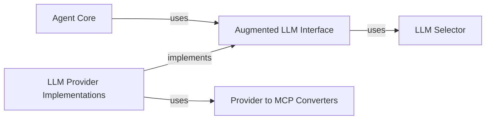

## Details

This subsystem defines the fundamental interface and capabilities of an AI agent, encapsulating interactions with Large Language Models (LLMs), external tools, prompts, and resources. It provides a consistent and extensible model for agent behavior and offers a standardized, augmented interface for interacting with various LLM providers.

### Agent Core
This is the foundational interface for all AI agents within the `mcp-agent` framework. It defines the core capabilities and interaction points of an agent, serving as the base for more specialized agent types. It encapsulates the agent's logic, its interaction with LLMs, and its ability to utilize external tools and resources.

**Related Classes/Methods**:

- `mcp_agent.agents.agent.Agent` (56:934)

### Augmented LLM Interface
This abstract component provides a unified and enhanced interface for interacting with different LLM providers. It abstracts away the vendor-specific details of LLM APIs, allowing the rest of the framework to interact with LLMs in a consistent manner, regardless of the underlying provider. It supports various LLM operations, including completion and structured completion requests.

**Related Classes/Methods**:

- `mcp_agent.workflows.llm.augmented_llm.AugmentedLLM` (218:668)

### LLM Selector
This component is responsible for intelligently selecting the most suitable LLM model for a given task. It considers various criteria such as cost, latency, and performance benchmarks to make informed decisions, optimizing resource utilization and response quality.

**Related Classes/Methods**:

- `mcp_agent.workflows.llm.llm_selector.ModelSelector` (96:413)

### LLM Provider Implementations
These are concrete implementations of the `Augmented LLM Interface`, providing the actual connectivity and interaction logic for specific LLM providers (e.g., Anthropic, Azure, Bedrock, Google, OpenAI, Ollama). Each implementation handles the nuances of its respective LLM API and translates requests and responses to and from the framework's internal format.

**Related Classes/Methods**:

- `mcp_agent.workflows.llm.augmented_llm_anthropic.AnthropicAugmentedLLM` (110:722)
- `mcp_agent.workflows.llm.augmented_llm_azure.AzureAugmentedLLM` (82:491)
- `mcp_agent.workflows.llm.augmented_llm_bedrock.BedrockAugmentedLLM` (48:349)
- `mcp_agent.workflows.llm.augmented_llm_google.GoogleAugmentedLLM` (34:319)
- `mcp_agent.workflows.llm.augmented_llm_ollama.OllamaAugmentedLLM` (16:78)
- `mcp_agent.workflows.llm.augmented_llm_openai.OpenAIAugmentedLLM` (80:845)

### Provider to MCP Converters
These utility classes are crucial for ensuring data consistency and interoperability across different LLM providers. They are responsible for converting provider-specific data structures (e.g., Anthropic's messages, OpenAI's chat completions) into the framework's standardized Model Context Protocol (MCP) types.

**Related Classes/Methods**:

- `mcp_agent.workflows.llm.augmented_llm_anthropic.AnthropicMCPTypeConverter` (777:886)
- `mcp_agent.workflows.llm.augmented_llm_azure.MCPAzureTypeConverter` (524:614)
- `mcp_agent.workflows.llm.augmented_llm_bedrock.BedrockMCPTypeConverter` (437:499)
- `mcp_agent.workflows.llm.augmented_llm_google.GoogleMCPTypeConverter` (403:518)
- `mcp_agent.workflows.llm.augmented_llm_openai.MCPOpenAITypeConverter` (949:1055)

### [FAQ](https://github.com/CodeBoarding/GeneratedOnBoardings/tree/main?tab=readme-ov-file#faq)
