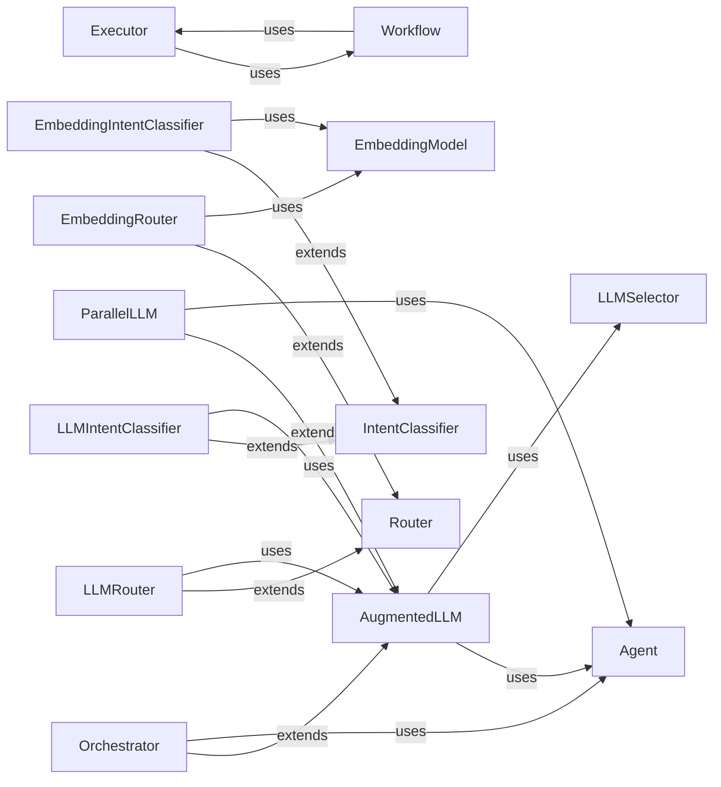

<Info>
This documentation was generated by [CodeBoarding](https://github.com/CodeBoarding/GeneratedOnBoardings) to provide comprehensive architectural insights into the mcp-agent framework.
</Info>

## Details

This updated analysis addresses the feedback provided, focusing on correcting source references, adhering to naming conventions, clarifying relationship types and directions, and including previously missing component definitions.

### Agent
The foundational abstraction for any AI agent within the `mcp-agent` framework. It defines the basic structure and behavior of an agent, serving as a base class for more specialized agent types. Agents can interact with MCP servers, call local functions, and manage their lifecycle.

**Related Classes/Methods**:

- <a href="https://github.com/CodeBoarding/mcp-agent/blob/main/src/mcp_agent/agents/agent.py#L56-L934" target="_blank" rel="noopener noreferrer">`mcp_agent.agents.agent.Agent` (56:934)</a>

### Executor
Responsible for the runtime execution of tasks and workflows. It provides the environment and manages the lifecycle of agent operations, ensuring that tasks are processed efficiently. It defines abstract methods for executing single or multiple tasks, streaming results, and handling signals.

**Related Classes/Methods**:

- <a href="https://github.com/CodeBoarding/mcp-agent/blob/main/src/mcp_agent/executor/executor.py#L52-L239" target="_blank" rel="noopener noreferrer">`mcp_agent.executor.executor.Executor` (52:239)</a>

### Workflow
Defines the structure and flow of a sequence of tasks, enabling complex multi-step operations. It provides a blueprint for how agents should interact and progress through a series of actions, offering state management and lifecycle methods (run, pause, resume, cancel).

**Related Classes/Methods**:

- <a href="https://github.com/CodeBoarding/mcp-agent/blob/main/src/mcp_agent/executor/workflow.py#L71-L528" target="_blank" rel="noopener noreferrer">`mcp_agent.executor.workflow.Workflow` (71:528)</a>

### AugmentedLLM
A specialized component that augments LLM capabilities by enabling tool calling, allowing agents to perform actions beyond simple text generation. It integrates with the `LLMSelector` to choose the optimal LLM for a given task and serves as a base for many other workflow patterns. It maintains a history of interactions and provides methods for generating text and structured outputs.

**Related Classes/Methods**:

- <a href="https://github.com/CodeBoarding/mcp-agent/blob/main/src/mcp_agent/workflows/llm/augmented_llm.py#L218-L668" target="_blank" rel="noopener noreferrer">`mcp_agent.workflows.llm.augmented_llm.AugmentedLLM` (218:668)</a>

### Orchestrator
A workflow pattern where a central LLM dynamically breaks down complex tasks into subtasks, delegates them to worker LLMs (which can be other `AugmentedLLM` instances or `Agent`s), and synthesizes their results. It operates in a loop until the main task is complete, supporting both full and iterative planning.

**Related Classes/Methods**:

- <a href="https://github.com/CodeBoarding/mcp-agent/blob/main/src/mcp_agent/workflows/orchestrator/orchestrator.py#L45-L585" target="_blank" rel="noopener noreferrer">`mcp_agent.workflows.orchestrator.orchestrator.Orchestrator` (45:585)</a>

### ParallelLLM
A workflow pattern that enables the concurrent execution of multiple tasks or sub-agents (fan-out) and programmatically aggregates their outputs (fan-in). This is useful for tasks requiring parallel processing for speed (sectioning) or multiple perspectives for higher confidence results (voting).

**Related Classes/Methods**:

- <a href="https://github.com/CodeBoarding/mcp-agent/blob/main/src/mcp_agent/workflows/parallel/parallel_llm.py#L23-L279" target="_blank" rel="noopener noreferrer">`mcp_agent.workflows.parallel.parallel_llm.ParallelLLM` (23:279)</a>

### IntentClassifier
An abstract base class for classifying user input or system messages to determine the underlying intent. This classification is crucial for guiding the framework to select the correct subsequent actions, agents, or workflows. Concrete implementations can use LLMs, embedding models, or other classification methods.

**Related Classes/Methods**:

- <a href="https://github.com/CodeBoarding/mcp-agent/blob/main/src/mcp_agent/workflows/intent_classifier/intent_classifier_base.py#L42-L85" target="_blank" rel="noopener noreferrer">`mcp_agent.workflows.intent_classifier.intent_classifier_base.IntentClassifier` (42:85)</a>

### LLMSelector
Responsible for dynamically selecting the most appropriate LLM for a given task based on criteria such as cost, latency, or specific capabilities. This optimizes resource usage and performance within the framework by providing a mechanism to choose from available LLM providers and models.

**Related Classes/Methods**:

- <a href="https://github.com/CodeBoarding/mcp-agent/blob/main/src/mcp_agent/workflows/llm/llm_selector.py#L24-L109" target="_blank" rel="noopener noreferrer">`mcp_agent.workflows.llm.llm_selector.LLMSelector` (24:109)</a>

### Router
An abstract base class for directing incoming requests or tasks to the appropriate MCP server, agent, or function based on predefined rules or learned patterns. It acts as a traffic controller, ensuring efficient routing within the agent system and enabling separation of concerns.

**Related Classes/Methods**:

- <a href="https://github.com/CodeBoarding/mcp-agent/blob/main/src/mcp_agent/workflows/router/router_base.py#L63-L275" target="_blank" rel="noopener noreferrer">`mcp_agent.workflows.router.router_base.Router` (63:275)</a>

### LLMIntentClassifier
A concrete implementation of `IntentClassifier` that leverages an `AugmentedLLM` to determine user intent. It is particularly useful for flexible natural language understanding, detailed reasoning about classifications, and entity extraction.

**Related Classes/Methods**:

- <a href="https://github.com/CodeBoarding/mcp-agent/blob/main/src/mcp_agent/workflows/intent_classifier/intent_classifier_llm.py#L63-L243" target="_blank" rel="noopener noreferrer">`mcp_agent.workflows.intent_classifier.intent_classifier_llm.LLMIntentClassifier` (63:243)</a>

### EmbeddingIntentClassifier
A concrete implementation of `IntentClassifier` that uses embedding similarity for classification. It supports various embedding models and is effective for semantic similarity-based classification and example-based learning.

**Related Classes/Methods**:

- <a href="https://github.com/CodeBoarding/mcp-agent/blob/main/src/mcp_agent/workflows/intent_classifier/intent_classifier_embedding.py#L32-L177" target="_blank" rel="noopener noreferrer">`mcp_agent.workflows.intent_classifier.intent_classifier_embedding.EmbeddingIntentClassifier` (32:177)</a>

### LLMRouter
A concrete implementation of `Router` that uses an `AugmentedLLM` to make routing decisions. It can route requests to specific MCP servers, agents, or functions based on the LLM's understanding of the input and available categories.

**Related Classes/Methods**:

- <a href="https://github.com/CodeBoarding/mcp-agent/blob/main/src/mcp_agent/workflows/router/router_llm.py#L81-L373" target="_blank" rel="noopener noreferrer">`mcp_agent.workflows.router.router_llm.LLMRouter` (81:373)</a>

### EmbeddingRouter
A concrete implementation of `Router` that uses embedding similarity to route requests. It computes embeddings for incoming requests and compares them to precomputed embeddings of available categories (servers, agents, functions) to determine the best route.

**Related Classes/Methods**:

- <a href="https://github.com/CodeBoarding/mcp-agent/blob/main/src/mcp_agent/workflows/router/router_embedding.py#L28-L239" target="_blank" rel="noopener noreferrer">`mcp_agent.workflows.router.router_embedding.EmbeddingRouter` (28:239)</a>

### EmbeddingModel
Represents a model used for generating embeddings, typically for semantic similarity tasks.

**Related Classes/Methods**: _None_

### [FAQ](https://github.com/CodeBoarding/GeneratedOnBoardings/tree/main?tab=readme-ov-file#faq)
