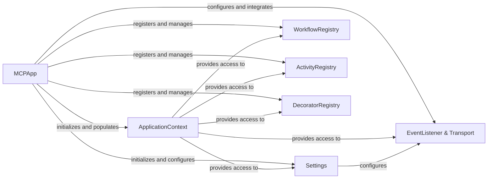

<Info>
This documentation was generated by [CodeBoarding](https://github.com/CodeBoarding/GeneratedOnBoardings) to provide comprehensive architectural insights into the mcp-agent framework.
</Info>

## Details

Overview of abstract components and their relationships within the MCP Agent application.

### MCPApp
The primary entry point and orchestrator for the MCP Agent application. It handles the initialization of the application context, loads configurations, registers core components like workflows, tasks, and decorators, and manages the overall application startup and shutdown. It acts as the central hub that brings all other core services together.

**Related Classes/Methods**:

- <a href="https://github.com/CodeBoarding/mcp-agent/blob/main/not_specified.py#L1-L1" target="_blank" rel="noopener noreferrer">`MCPApp` (1:1)</a>

### Settings
Defines and provides access to all application-wide configuration parameters. This includes settings for LLM providers, MCP communication, logging, and other operational aspects. It ensures that the application operates with a consistent and easily manageable set of parameters.

**Related Classes/Methods**:

- <a href="https://github.com/CodeBoarding/mcp-agent/blob/main/not_specified.py#L1-L1" target="_blank" rel="noopener noreferrer">`Settings` (1:1)</a>

### ApplicationContext
A singleton or globally accessible object that holds references to essential application services and resources, such as the configuration settings, various registries (workflows, tasks, decorators), and logging/telemetry instances. It provides a centralized way for different parts of the application to access shared resources without explicit dependency passing.

**Related Classes/Methods**:

- <a href="https://github.com/CodeBoarding/mcp-agent/blob/main/not_specified.py#L1-L1" target="_blank" rel="noopener noreferrer">`ApplicationContext` (1:1)</a>

### WorkflowRegistry
Manages the registration and retrieval of defined workflows within the application. Workflows represent the high-level orchestration logic for agents. This registry allows the application to dynamically discover and execute different workflow patterns.

**Related Classes/Methods**:

- <a href="https://github.com/CodeBoarding/mcp-agent/blob/main/src/mcp_agent/executor/workflow_registry.py#L19-L146" target="_blank" rel="noopener noreferrer">`WorkflowRegistry` (19:146)</a>

### ActivityRegistry
Manages the registration and retrieval of individual activities or tasks that can be performed by agents or within workflows. These are the granular units of work that agents can execute.

**Related Classes/Methods**:

- <a href="https://github.com/CodeBoarding/mcp-agent/blob/main/not_specified.py#L1-L1" target="_blank" rel="noopener noreferrer">`ActivityRegistry` (1:1)</a>

### DecoratorRegistry
Manages the registration and application of decorators that can modify the behavior of workflows, tasks, or agents. This allows for cross-cutting concerns like logging, tracing, or error handling to be applied declaratively.

**Related Classes/Methods**:

- <a href="https://github.com/CodeBoarding/mcp-agent/blob/main/src/mcp_agent/executor/decorator_registry.py#L1-L1" target="_blank" rel="noopener noreferrer">`DecoratorRegistry` (1:1)</a>

### EventListener & Transport
These components are part of the observability infrastructure. `EventListener` defines interfaces for processing application events (e.g., for logging, metrics), while `EventTransport` handles the actual delivery of these events to various destinations (console, file, HTTP). They are initialized as part of the global context setup.

**Related Classes/Methods**:

- <a href="https://github.com/CodeBoarding/mcp-agent/blob/main/not_specified.py#L1-L1" target="_blank" rel="noopener noreferrer">`EventListener` (1:1)</a>
- <a href="https://github.com/CodeBoarding/mcp-agent/blob/main/not_specified.py#L1-L1" target="_blank" rel="noopener noreferrer">`EventTransport` (1:1)</a>

### [FAQ](https://github.com/CodeBoarding/GeneratedOnBoardings/tree/main?tab=readme-ov-file#faq)
