<Info>

```mermaid
graph LR
    Tool_Capability_Registry["Tool & Capability Registry"]
    Application_Server_MCPApp_["Application Server (MCPApp)"]
    Agent_Core["Agent Core"]
    Workflow_Engine["Workflow Engine"]
    Tool_Integration_Layer["Tool Integration Layer"]
    MCP_Communication_Layer["MCP Communication Layer"]
    LLM_Integration_Layer["LLM Integration Layer"]
    Configuration_Management["Configuration Management"]
    Observability_Logging["Observability & Logging"]
    Intent_Classification_Routing["Intent Classification/Routing"]
    Application_Server_MCPApp_ -- "initializes" --> Tool_Capability_Registry
    Tool_Capability_Registry -- "provides capabilities to" --> Agent_Core
    Tool_Capability_Registry -- "provides capabilities to" --> Workflow_Engine
    Tool_Integration_Layer -- "registers capabilities with" --> Tool_Capability_Registry
    Tool_Capability_Registry -- "interacts with" --> MCP_Communication_Layer
    Application_Server_MCPApp_ -- "orchestrates" --> Agent_Core
    Application_Server_MCPApp_ -- "orchestrates" --> Workflow_Engine
    Application_Server_MCPApp_ -- "loads" --> Configuration_Management
    Application_Server_MCPApp_ -- "integrates" --> Observability_Logging
    Agent_Core -- "executes tasks via" --> Workflow_Engine
    Agent_Core -- "interacts with" --> LLM_Integration_Layer
    Intent_Classification_Routing -- "routes requests to" --> Agent_Core
    Workflow_Engine -- "orchestrates" --> Agent_Core
    Workflow_Engine -- "interacts with" --> LLM_Integration_Layer
    Workflow_Engine -- "utilizes" --> Observability_Logging
    Tool_Integration_Layer -- "may use" --> LLM_Integration_Layer
    MCP_Communication_Layer -- "communicates with" --> Application_Server_MCPApp_
    LLM_Integration_Layer -- "provides services to" --> Agent_Core
    LLM_Integration_Layer -- "provides services to" --> Workflow_Engine
    Configuration_Management -- "configures" --> LLM_Integration_Layer
    Configuration_Management -- "configures" --> Application_Server_MCPApp_
    Observability_Logging -- "receives data from" --> Application_Server_MCPApp_
    Observability_Logging -- "receives data from" --> Workflow_Engine
    Intent_Classification_Routing -- "routes requests to" --> Workflow_Engine
    Intent_Classification_Routing -- "uses" --> LLM_Integration_Layer
    click Tool_Capability_Registry href "/codeboarding/Tool_Capability_Registry.md" "Details"
```

This documentation was generated by [CodeBoarding](https://github.com/CodeBoarding/GeneratedOnBoardings) to provide comprehensive architectural insights into the mcp-agent framework.
</Info>

## Details

AI Agent Framework

### Tool & Capability Registry [[Expand]](./Tool_Capability_Registry)
Central repository for registering and discovering executable capabilities (activities, decorators, signals). It's fundamental for framework extensibility and dynamic tool utilization, allowing agents and workflows to find and use available functionalities.

**Related Classes/Methods**:

- <a href="https://github.com/CodeBoarding/mcp-agent/blob/main/src/mcp_agent/executor/task_registry.py" target="_blank" rel="noopener noreferrer">`mcp_agent.executor.task_registry.ActivityRegistry`</a>
- <a href="https://github.com/CodeBoarding/mcp-agent/blob/main/src/mcp_agent/executor/decorator_registry.py" target="_blank" rel="noopener noreferrer">`mcp_agent.executor.decorator_registry.DecoratorRegistry`</a>
- <a href="https://github.com/CodeBoarding/mcp-agent/blob/main/src/mcp_agent/executor/signal_registry.py#L3-L29" target="_blank" rel="noopener noreferrer">`mcp_agent.executor.signal_registry.SignalRegistry` (3:29)</a>

### Application Server (MCPApp)
The core application orchestrator and entry point. It's responsible for initializing and integrating all framework components, including the registries, configuration, and execution environment. Fundamental for bringing the entire system to life and managing its lifecycle.

**Related Classes/Methods**:

- <a href="https://github.com/CodeBoarding/mcp-agent/blob/main/src/mcp_agent/app.py" target="_blank" rel="noopener noreferrer">`mcp_agent.app`</a>

### Agent Core
Defines the fundamental structure, behavior, and lifecycle of an AI agent. Agents interact with the Tool & Capability Registry to discover and invoke tools, enabling them to perform tasks and achieve goals. Fundamental as it embodies the "agent" concept of the framework.

**Related Classes/Methods**:

- <a href="https://github.com/CodeBoarding/mcp-agent/blob/main/src/mcp_agent/agents/agent.py" target="_blank" rel="noopener noreferrer">`mcp_agent.agents.agent`</a>

### Workflow Engine
Manages the execution flow and orchestration of complex, multi-step tasks and processes. It leverages the Tool & Capability Registry to find and execute the necessary activities and signals as part of a defined workflow. Fundamental for enabling sophisticated, multi-stage AI processes.

**Related Classes/Methods**:

- <a href="https://github.com/CodeBoarding/mcp-agent/blob/main/src/mcp_agent/executor/executor.py" target="_blank" rel="noopener noreferrer">`mcp_agent.executor.executor`</a>
- <a href="https://github.com/CodeBoarding/mcp-agent/blob/main/src/mcp_agent/executor/workflow.py" target="_blank" rel="noopener noreferrer">`mcp_agent.executor.workflow`</a>

### Tool Integration Layer
Provides the mechanisms for adapting and registering external functionalities or custom code as usable "tools" within the framework. This layer is fundamental for extending the framework's operational scope and connecting it to diverse external services.

**Related Classes/Methods**:

- <a href="https://github.com/CodeBoarding/mcp-agent/blob/main/mcp_agent/tools/" target="_blank" rel="noopener noreferrer">`mcp_agent.tools`</a>

### MCP Communication Layer
Facilitates inter-service communication and capability discovery across different Multi-Component Protocol (MCP) instances. This is fundamental for building distributed AI agent systems, allowing agents to interact with remote services.

**Related Classes/Methods**:

- <a href="https://github.com/CodeBoarding/mcp-agent/blob/main/src/mcp_agent/mcp/mcp_aggregator.py" target="_blank" rel="noopener noreferrer">`mcp_agent.mcp.mcp_aggregator`</a>
- <a href="https://github.com/CodeBoarding/mcp-agent/blob/main/src/mcp_agent/mcp/mcp_connection_manager.py" target="_blank" rel="noopener noreferrer">`mcp_agent.mcp.mcp_connection_manager`</a>
- <a href="https://github.com/CodeBoarding/mcp-agent/blob/main/src/mcp_agent/mcp/mcp_server_registry.py" target="_blank" rel="noopener noreferrer">`mcp_agent.mcp.mcp_server_registry`</a>

### LLM Integration Layer
Provides standardized interfaces and adapters for interacting with various Large Language Models (LLMs) from different providers. This layer is fundamental as it provides the core intelligence and reasoning capabilities for the AI agents and workflows.

**Related Classes/Methods**:

- <a href="https://github.com/CodeBoarding/mcp-agent/blob/main/src/mcp_agent/workflows/llm/augmented_llm.py" target="_blank" rel="noopener noreferrer">`mcp_agent.workflows.llm.augmented_llm`</a>
- <a href="https://github.com/CodeBoarding/mcp-agent/blob/main/src/mcp_agent/workflows/llm/augmented_llm_anthropic.py" target="_blank" rel="noopener noreferrer">`mcp_agent.workflows.llm.augmented_llm_anthropic`</a>
- <a href="https://github.com/CodeBoarding/mcp-agent/blob/main/src/mcp_agent/workflows/llm/augmented_llm_openai.py" target="_blank" rel="noopener noreferrer">`mcp_agent.workflows.llm.augmented_llm_openai`</a>

### Configuration Management
Handles the loading, validation, and provision of application settings and configurations. It's fundamental for flexible deployment, customization, and environment-specific adjustments of the framework.

**Related Classes/Methods**:

- <a href="https://github.com/CodeBoarding/mcp-agent/blob/main/src/mcp_agent/config.py" target="_blank" rel="noopener noreferrer">`mcp_agent.config.Settings`</a>
- <a href="https://github.com/CodeBoarding/mcp-agent/blob/main/src/mcp_agent/config.py" target="_blank" rel="noopener noreferrer">`mcp_agent.config.OpenAISettings`</a>

### Observability & Logging
Provides mechanisms for monitoring, logging, and tracing events within the framework. This is fundamental for debugging, performance analysis, and understanding the complex behavior of AI agents and workflows.

**Related Classes/Methods**:

- <a href="https://github.com/CodeBoarding/mcp-agent/blob/main/src/mcp_agent/logging/listeners.py" target="_blank" rel="noopener noreferrer">`mcp_agent.logging.listeners.EventListener`</a>
- <a href="https://github.com/CodeBoarding/mcp-agent/blob/main/src/mcp_agent/logging/transport.py" target="_blank" rel="noopener noreferrer">`mcp_agent.logging.transport.EventTransport`</a>

### Intent Classification/Routing
Components responsible for understanding user intent or routing requests to appropriate agents/workflows based on input. This is fundamental for directing agent behavior, managing complex interactions, and enabling intelligent decision-making.

**Related Classes/Methods**:

- <a href="https://github.com/CodeBoarding/mcp-agent/blob/main/mcp_agent/workflows/intent_classifier/" target="_blank" rel="noopener noreferrer">`mcp_agent.workflows.intent_classifier`</a>
- <a href="https://github.com/CodeBoarding/mcp-agent/blob/main/mcp_agent/workflows/router/" target="_blank" rel="noopener noreferrer">`mcp_agent.workflows.router`</a>

### [FAQ](https://github.com/CodeBoarding/GeneratedOnBoardings/tree/main?tab=readme-ov-file#faq)
