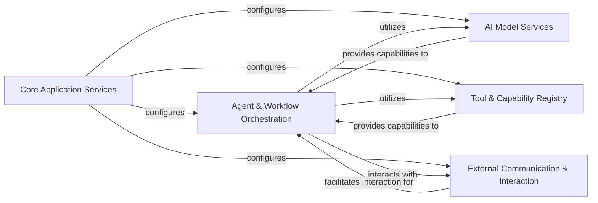

<Info>
This documentation was generated by [CodeBoarding](https://github.com/CodeBoarding/GeneratedOnBoardings) to provide comprehensive architectural insights into the mcp-agent framework.
</Info>

## Details

The `mcp-agent` project is an AI Agent Framework designed to orchestrate complex AI behaviors. At its core, the **Agent & Workflow Orchestration** component defines agent logic and manages the execution of tasks and intricate workflows, leveraging various AI agent patterns. This component relies heavily on **AI Model Services** for integrating with Large Language Models (LLMs) and embedding models, providing the necessary intelligence for agent operations. A **Tool & Capability Registry** centralizes the discovery and invocation of executable actions that agents can utilize. All these foundational components are initialized and configured by the **Core Application Services**, which manages the overall application lifecycle and global context. Finally, the framework interacts with external systems and human users through the **External Communication & Interaction** component, facilitating multi-agent collaboration via the Multi-Agent Communication Protocol (MCP) and handling direct human input and output.

### Core Application Services [[Expand]](./Core_Application_Services)
Initializes and manages the overall application lifecycle, global context, and provides access to application-wide configuration settings. It acts as the central orchestrator for setting up the environment.

**Related Classes/Methods**:

- <a href="https://github.com/CodeBoarding/mcp-agent/blob/main/src/mcp_agent/app.py#L34-L508" target="_blank" rel="noopener noreferrer">`mcp_agent.app.MCPApp` (34:508)</a>
- <a href="https://github.com/CodeBoarding/mcp-agent/blob/main/src/mcp_agent/core/context.py" target="_blank" rel="noopener noreferrer">`mcp_agent.core.context.initialize_context`</a>
- <a href="https://github.com/CodeBoarding/mcp-agent/blob/main/src/mcp_agent/config.py" target="_blank" rel="noopener noreferrer">`mcp_agent.config.get_settings`</a>
- <a href="https://github.com/CodeBoarding/mcp-agent/blob/main/src/mcp_agent/config.py" target="_blank" rel="noopener noreferrer">`mcp_agent.config.Settings`</a>

### Agent & Workflow Orchestration [[Expand]](./Agent_Workflow_Orchestration)
Defines the fundamental AI agent abstraction, manages the execution of tasks and complex workflows, and orchestrates various AI agent patterns (e.g., Orchestration, Parallel, Intent Classification). It serves as the central brain and execution engine for agent behaviors.

**Related Classes/Methods**:

- <a href="https://github.com/CodeBoarding/mcp-agent/blob/main/src/mcp_agent/agents/agent.py#L56-L934" target="_blank" rel="noopener noreferrer">`mcp_agent.agents.agent.Agent` (56:934)</a>
- <a href="https://github.com/CodeBoarding/mcp-agent/blob/main/src/mcp_agent/executor/executor.py#L52-L239" target="_blank" rel="noopener noreferrer">`mcp_agent.executor.executor.Executor` (52:239)</a>
- <a href="https://github.com/CodeBoarding/mcp-agent/blob/main/src/mcp_agent/executor/workflow.py#L71-L528" target="_blank" rel="noopener noreferrer">`mcp_agent.executor.workflow.Workflow` (71:528)</a>
- <a href="https://github.com/CodeBoarding/mcp-agent/blob/main/src/mcp_agent/workflows/orchestrator/orchestrator.py#L45-L585" target="_blank" rel="noopener noreferrer">`mcp_agent.workflows.orchestrator.orchestrator.Orchestrator` (45:585)</a>
- <a href="https://github.com/CodeBoarding/mcp-agent/blob/main/src/mcp_agent/workflows/parallel/parallel_llm.py#L23-L279" target="_blank" rel="noopener noreferrer">`mcp_agent.workflows.parallel.parallel_llm.ParallelLLM` (23:279)</a>
- <a href="https://github.com/CodeBoarding/mcp-agent/blob/main/src/mcp_agent/workflows/intent_classifier/intent_classifier_base.py#L42-L85" target="_blank" rel="noopener noreferrer">`mcp_agent.workflows.intent_classifier.intent_classifier_base.IntentClassifier` (42:85)</a>

### AI Model Services [[Expand]](./AI_Model_Services)
Provides a unified interface for interacting with various Large Language Models (LLMs) and embedding models. It handles model selection, prompt conversion, tool calling through LLMs, and text embedding generation for semantic understanding.

**Related Classes/Methods**:

- <a href="https://github.com/CodeBoarding/mcp-agent/blob/main/src/mcp_agent/workflows/llm/augmented_llm.py#L218-L668" target="_blank" rel="noopener noreferrer">`mcp_agent.workflows.llm.augmented_llm.AugmentedLLM` (218:668)</a>
- <a href="https://github.com/CodeBoarding/mcp-agent/blob/main/src/mcp_agent/workflows/llm/llm_selector.py#L96-L413" target="_blank" rel="noopener noreferrer">`mcp_agent.workflows.llm.llm_selector.ModelSelector` (96:413)</a>
- <a href="https://github.com/CodeBoarding/mcp-agent/blob/main/src/mcp_agent/workflows/embedding/embedding_base.py#L13-L31" target="_blank" rel="noopener noreferrer">`mcp_agent.workflows.embedding.embedding_base.EmbeddingModel` (13:31)</a>

### External Communication & Interaction
Manages all external communication, including interaction with Multi-Agent Communication Protocol (MCP) servers for capability aggregation, and handling human input/output for interactive agent experiences.

**Related Classes/Methods**:

- <a href="https://github.com/CodeBoarding/mcp-agent/blob/main/src/mcp_agent/mcp/mcp_aggregator.py#L77-L1357" target="_blank" rel="noopener noreferrer">`mcp_agent.mcp.mcp_aggregator.MCPAggregator` (77:1357)</a>
- <a href="https://github.com/CodeBoarding/mcp-agent/blob/main/src/mcp_agent/mcp/mcp_connection_manager.py" target="_blank" rel="noopener noreferrer">`mcp_agent.mcp.mcp_connection_manager.MCPConnectionManager`</a>
- <a href="https://github.com/CodeBoarding/mcp-agent/blob/main/src/mcp_agent/human_input/handler.py#L67-L72" target="_blank" rel="noopener noreferrer">`mcp_agent.human_input.handler.console_input_callback` (67:72)</a>
- <a href="https://github.com/CodeBoarding/mcp-agent/blob/main/src/mcp_agent/elicitation/handler.py#L137-L151" target="_blank" rel="noopener noreferrer">`mcp_agent.elicitation.handler.console_elicitation_callback` (137:151)</a>

### Tool & Capability Registry [[Expand]](./Tool_Capability_Registry)
Centralizes the registration, discovery, and invocation of various executable capabilities (activities, decorators, signals) that agents and workflows can utilize, acting as a repository of available "tools" or functions.

**Related Classes/Methods**:

- <a href="https://github.com/CodeBoarding/mcp-agent/blob/main/src/mcp_agent/executor/task_registry.py" target="_blank" rel="noopener noreferrer">`mcp_agent.executor.task_registry.ActivityRegistry`</a>
- <a href="https://github.com/CodeBoarding/mcp-agent/blob/main/src/mcp_agent/executor/decorator_registry.py" target="_blank" rel="noopener noreferrer">`mcp_agent.executor.decorator_registry.DecoratorRegistry`</a>
- <a href="https://github.com/CodeBoarding/mcp-agent/blob/main/src/mcp_agent/executor/signal_registry.py#L3-L29" target="_blank" rel="noopener noreferrer">`mcp_agent.executor.signal_registry.SignalRegistry` (3:29)</a>

### [FAQ](https://github.com/CodeBoarding/GeneratedOnBoardings/tree/main?tab=readme-ov-file#faq)
